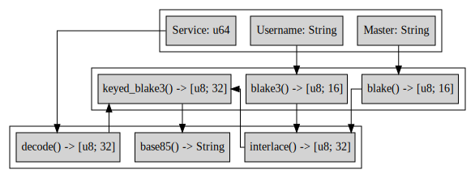

# PassPlexer
## A Password Obfuscation Algorithm
---
### Description
Passplexer is designed to create a more secure password without having to remember it.   
Just use a single master password with a username and service name to create a more secure password.

No information is ever logged. Period.

---
### Algorithm

